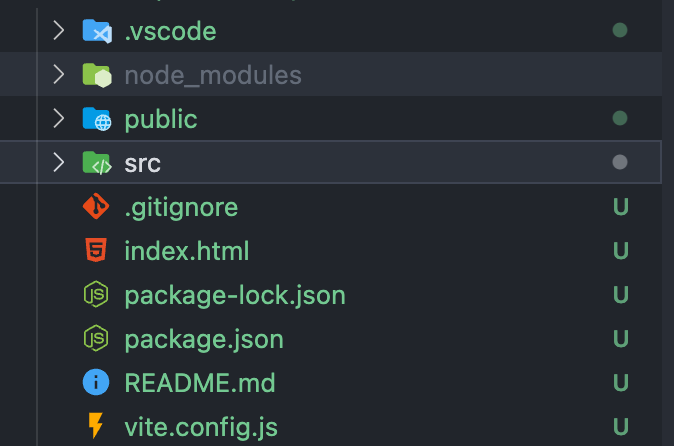
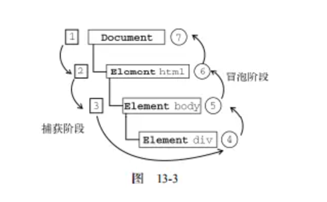

# 1. [VueJS 3.0](https://cn.vuejs.org/)

# 2. Chapter 1: Vue Base

## 2.1. Precondition

> Versions of Node.js > 15.0
> [How to update Node.js](https://juejin.cn/post/7161634586824212488)
> Install `vue`: `npm install -g @vue/cli`

## 2.2. Create Vue Project

1. `npm init vue@latest`
   这一指令将会安装并执行`create-vue`，它是 Vue 官方的项目脚手架工具。执行后将会看到一些诸如 TypeScript 和测试支持之类的可选功能提示

```bash
✔ Project name: … vue-base
✔ Add TypeScript? … No / Yes
✔ Add JSX Support? … No / Yes
✔ Add Vue Router for Single Page Application development? … No / Yes
✔ Add Pinia for state management? … No / Yes
✔ Add Vitest for Unit Testing? … No / Yes
✔ Add an End-to-End Testing Solution? › No
✔ Add ESLint for code quality? … No / Yes
```

> 1. `Project name:` 项目名称，**不能存在大写**
> 2. `Add TypeScript?`: 是否添加`TypeScript`
> 3. `Add JSX Suppor?`: 是否添加`JSX`语法支持, `JSX`是`ReactJS`的特有文件后缀
> 4. `Add Vue Router for Single Page Application develipment?`: 是否添加 Vue 路由
> 5. `Add Pinia for state management?`: 是否添加`Pinia`状态管理
> 6. `Add Vitest for Unit Testing?` : 单元测试功能
> 7. `Add an End-to-End Testing Solution?` : 端对端测试
> 8. `Add ESLint for code quality? `: 代码质量相关

2. 项目创建完成后会提示执行一下命令：

```bash
Done. Now run:

  cd vue-base
  npm install # 安装dependencies
  npm run dev # 运行项目
```

## 2.3. 安装`cnpm`

> `cnpm` 是 `npm`的国内淘宝镜像，会比`npm`要快
>
> 1. 安装命令：`sudo npm install -g cnpm --registry=https://registry.npm.taobao.org`
> 2. 查看版本：`cnpm -v`

# 3. Vue Project Structure



```js
.vscode         --- VSCODE工具的配置文件
node_modules    --- Vue项目的运行依赖文件夹,执行npm install时，依赖文件会安装到这里
public          --- 资源文件夹（浏览器图标）
src             --- 源码文件夹
.gitignore      --- git忽略文件
index.html      --- 入口HTMl文件
package.json    --- 信息描述文件
README.md       --- 项目描述文件
vite.config.js  --- Vue配置文件
```

# `Template` Syntax - 模版语法

> Vue 使用一种基于`HTML`的模版语法，使我们能够声明式地将其组件实例的数据绑定到呈现的 DOM 上，所有的`Vue`模版都是语法层面合法的`HTML`，可以被符合规范的浏览器和`HTML`解析器解析

## Text Interpolation - 文本插值

最基本的数据绑定形式时文本差值（Text Interpolation， 它使用的是 "Mustache" 语法（即双大括号 `{{ }}`）：

```html
<template>
    <p>{{ msg }}</p>
</template>

<script>
    export default {
        data() {
            return {
                msg: "神奇的魔法",
            };
        },
    };
</script>
```

## Using `JavaScript` Expressions

每一个绑定仅支持单一表达式，也就是一段能够被求值的`JavaScript`代码。一个简单的判断代码是是否可以合法写在`return`后面。

```html
<template>
    <p>{{ number + 1 }}</p>
    <p>{{ ok ? 'Yes' : 'No' }}</p>
    <p>{{ mssage.split('').reverse().join('') }}</p>
</template>

<script>
    export default {
        data() {
            return {
                number: 10,
                ok: true,
                message: "大家好",
            };
        },
    };
</script>
```

## 原始`HTML`

双大括号将会将数据插值为纯文本，而不是`HTML`。若想插入`HTML`，则需要使用`v-html`指令

```html
<template>
    <p>纯文本: {{ rawHtml }}</p>
    <p>
        属性：
        <span v-html="rawHtml"></span>
    </p>
</template>
<script>
    export default {
        data() {
            return {
                rawHtml: "<a href='https://www.google.com'>Google</a>",
            };
        },
    };
</script>
```

# Attribute Bindings - 属性绑定

文本差值`{{}}`不能用在`HTML` attributes 中。想要响应式地绑定一个 attribute,应该使用`v-bind`指令

```html
<template>
    <div v-bind:id="dynamicId" v-bind:class="dynamicClass">Test</div>
</template>

<script>
    export default {
        data() {
            return {
                dynamicClass: "appClass",
                dynamicId: "appID",
            };
        },
    };
</script>

<style>
    .appClass {
        color: red;
        font-size: 30px;
    }
</style>
```

`v-bind`指令指示 Vue 将元素的`id`attribute 与组件的`dynamicId`属性保持一致。如果绑定的值是`null`或者`undefined`，那么该 attribute 将会从渲染的元素上移除

### Shorthand - 简写

因为`v-bind`非常常用，我们提供了特定的简写语法

```html
<div :id="dynamicId" :class="dynamicClass"></div>
```

## Boolean Attributes - 布尔型 Attribute

布尔型 attribute 依据 true/false 值来决定 attribute 是否应该存在于该元素上，`disabled`就是最常见的例子之一

```html
<button :disabled="isButtonDisabled">Button</button>
```

## Dynamically Binding Multiple Attributes - 动态绑定多个值

如果你有像这个一个包含多个 attribute 的 `JavaScript` 对象

```js
const objectOfAttrs = {
    id: "container",
    class: "wrappper",
};
```

# Conditional Rendering - 条件渲染

-   `v-if`
-   `v-else`
-   `v-else-if`
-   `v-show`

## `v-if`

`v-if` 指令用于条件性地渲染一块内容。这块内容只会在指令的表达式返回真值时才被渲染

## `v-else`

也可以使用`v-else`为`v-if`添加一个“else 区块“

> 一个元素`v-else`必须跟在一个`v-if`或者`v-else-if`元素后面，否则它将不会被识别。

## `v-else-if`

顾名思义，`v-else-if` 提供的是相应于`v-if`的"else if 区块“。它可以连续多次重复使用

> 和`v-else`类似，一个使用`v-else-if`的元素必须紧跟在一个`v-if`或一个`v-else-if`元素后面

## `v-show`

另一个可以用来按条件显示一个元素的指令是`v-show`。其用法基本一样：

不用之处在于`v-show`会在 DOM 渲染中保留该元素；`v-show`仅切换了该元素上名为`display`的 CSS 属性。

`v-show` 不支持在`<template>`元素上使用，也不能和`v-else`搭配使用。

## `v-if` VS `v-show`

`v-if` 是"真实的"按条件渲染，因为它确保了在切换时，条件区块内的条件监听器和子组件都会被销毁与重建。
`v-if` 也是**惰性**的：如果在初次渲染时条件值为 false，则不会做任何事。条件区块只有当条件首次变为 true 时才被渲染。‘
相比之下，`v-show`简单许多，元素无论初始条件如何，始终会被渲染，只有 CSS`display`属性会被切换。
总的来说，`v-if`有更高的切换开销，而`v-show`有更高的初始渲染开销。因此，如果需要频繁切换，则使用`v-show`较好；如果运行时绑定条件很少改变，则`v-if`会更为合适。

```html
<template>
    <h3>Conditional Rendering</h3>
    <div v-if="flag">Can u see me ?</div>
    <div v-else>Then u should see me</div>
    <div v-if="type === 'A'">A</div>
    <div v-else-if="type === 'B'">B</div>
    <div v-else-if="type === 'C'">C</div>
    <div v-else>Not A/B/C</div>
    <div v-show="flag">Can u see me ?</div>
</template>

<script>
    export default {
        data() {
            return {
                flag: true,
                type: "B",
            };
        },
    };
</script>
```

# List Rendering - 列表渲染

我们可以使用`v-for`指令基于一个数组来渲染一个列表。`v-for`指令的值需要使用`item in items`形式的特殊语法，其中`items`是源数据的数组，`item`是迭代项的别名.
在`v-for`快中可以完整地访问父作用域内的数据和变量。`v-for`也支持可选的第二个参数表示当前项的位置索引。

```html
<template>
    <h3>List Rendering</h3>
    <p v-for="name in names">{{ name }}</p>
</template>

<script>
    export default {
        data() {
            return {
                names: ["Chris", "Lyrics", "Murphy"],
            };
        },
    };
</script>
```

## 复杂数据

大多数情况，我们渲染的数据源来源于网络请求，也就是`JSON`格式

```html
<template>
    <h3>List Rendering</h3>
    <div v-for="item in results">
        <p>{{ item.title }}</p>
        <!-- 属性绑定 -->
        
    </div>
</template>

<script>
    export default {
        data() {
            return {
                results: [
                    {
                        id: 2261677,
                        title: "鄂尔多斯｜感受一座城市的璀璨夜景 感受一座城市，除了白日里的车水马龙，喧嚣繁华之",
                        avator: "https://pic.qyer.com/avatar/002/25/77/30/200?v=1560226451",
                    },
                    {
                        id: 2261566,
                        title: "成都这家洞穴暗黑风咖啡厅酷毙了！！早C晚A走起☕️ 成都天气这么🔥 咖啡🌟人必备",
                        avator: "https://pic.qyer.com/avatar/002/25/77/30/200?v=1560226451",
                    },
                    {
                        id: 2261662,
                        title: "[川西新龙-措卡湖]措卡湖吗，意为“乱世从中的黑色海水”，神秘小众 原汁原味。",
                        avator: "https://pic.qyer.com/avatar/002/25/77/30/200?v=1560226451",
                    },
                ],
            };
        },
    };
</script>
```

`v-for`也支持使用可选的第二个参数表示当前项的位置索引

```html
<template>
    <h3>List Rendering</h3>
    <p v-for="(item, index) in names">{{ item }} - {{ index }}</p>
</template>

<script>
    export default {
        data() {
            return {
                names: ["Chris", "Lyrics", "Murphy"],
            };
        },
    };
</script>
```

也可以使用`of`作为分隔符来替代`in`,这更接近 `JavaScript` 的迭代器语法

```html
<div v-for="item of items"></div>
```

## `v-for`对象

也可以使用`v-for`来遍历一个对象的所有属性

```html
<template>
    <h3>List Rendering</h3>
    <!-- 默认遍历顺序 -->
    <div v-for="(value, key, index) in userInfo">
        <p>{{ index }}- {{ key }}-{{ value }}</p>
    </div>
    <!-- <p>{{ userInfo.name }}-{{ userInfo.age }}-{{ userInfo.sex }}</p> -->
</template>

<script>
    export default {
        data() {
            return {
                userInfo: {
                    // key : value
                    name: "iwen",
                    age: 20,
                    sex: "male",
                },
            };
        },
    };
</script>
```

## 通过 key 管理状态

`Vue`默认按照“就地更新”的策略来更新通过`v-for`渲染的元素列表。当数据项的顺序改变时，`Vue`不会随之移动 DOM 元素的顺序，而是就地更新每个元素，确保他们在原本制定的索引位置上渲染。
为了给`Vue`一个提示，以便它可以跟踪每个节点的标识，从而重用和重新排序现有的元素，你需要为每个元素对应的块提供一个唯一的`key` attribute:

> 个人理解：key 绑定的作用就是告诉`Vue`在渲染的时候基于什么来给数据项建立索引，默认情况下是按照其定义顺序（代码顺序），这样如果代码顺序发生改变，在没有 key 的情况下，为了确保数据随之更新，`Vue`会重新渲染所有数据，并更新所有数据对应的索引（即便有些数据没有任何更新-浪费资源）。如果提供的 key，则`Vue`会根据 key 提供的 attribute 来建立索引，这样就算数据发生改变，原本顺序没有发生变化的某些数据则不会进行更新，只更新索引和 key 在更新后不匹配的部分，从而节省资源。

```html
<template>
    <h3>v-for Status Management by key</h3>
    <p v-for="(item, index) in names" :key="index">{{ index }}-{{ item }}</p>
</template>
<script>
    export default {
        data() {
            return {
                names: ["Chris", "Lyrics", "Murphy"],
            };
        },
    };
</script>
```

> **温馨提示** > `key`在这里是通过一个`v-bind`绑定的特殊 attribute
> 推荐在任何可行的时候为`v-for`提供一个`key` attribute
> `key`绑定的值期望是一个基础类型的值，例如字符串或者 number 类型

### key 的来源

在真实的应用场景中，不推荐使用`index`作为 key，要确保每一条数据的唯一索引不会发生变化(例如使用`id`)

```html
<template>
    <h3>v-for Status Management by key</h3>
    <div v-for="item in results" :key="item.id">
        <p>{{ item.title }}</p>
        
    </div>
</template>
<script>
    export default {
        data() {
            return {
                results: [
                    {
                        id: 2261677,
                        title: "鄂尔多斯｜感受一座城市的璀璨夜景 感受一座城市，除了白日里的车水马龙，喧嚣繁华之",
                        avator: "https://pic.qyer.com/avatar/002/25/77/30/200?v=1560226451",
                    },
                    {
                        id: 2261566,
                        title: "成都这家洞穴暗黑风咖啡厅酷毙了！！早C晚A走起☕️ 成都天气这么🔥 咖啡🌟人必备",
                        avator: "https://pic.qyer.com/avatar/002/25/77/30/200?v=1560226451",
                    },
                    {
                        id: 2261662,
                        title: "[川西新龙-措卡湖]措卡湖吗，意为“乱世从中的黑色海水”，神秘小众 原汁原味。",
                        avator: "https://pic.qyer.com/avatar/002/25/77/30/200?v=1560226451",
                    },
                ],
            };
        },
    };
</script>
```

# Event Handing - 事件处理 `@event`

我们可以使用`v-on`指令（简写`@`）来监听 DOM 事件，并在实践触发时执行对应的`JavaScript`.用法：`v-on:click="methodName"`或`@click='handler'`
事件处理器的值可以是

1. 内联事件处理器： 事件被触发时执行的内联 `JavaScript` 语句（与`onclick`类似）
2. 方法事件处理器： 一个指向组件上定义的方法的属性名或是路径

## Inline Handlers - 内联事件处理器

内联事件处理器通常用于简单场景

```html
<template>
    <button @click="count++">Add 1</button>
    <p>Count is: {{ count }}</p>
</template>

<script>
    export default {
        data() {
            return {
                count: 0,
            };
        },
    };
</script>
```

## Method Handlers - 方法事件处理器

方法事件处理器自动接收原生 DOM 事件并触发执行。

```html
<template>
    <h3>Methode event handler</h3>
    <button @click="addCount">Add</button>
    <p>Count is: {{ count }}</p>
</template>

<script>
    export default {
        data() {
            return {
                count: 0,
            };
        },
        methods: {
            addCount() {
                this.count += 1;
            },
        },
    };
</script>
```

## Method vs. Inline Detection - 方式与内联事件判断

模版编译器会通过检查`v-on`的值是否是合法的`JavaScript`标识符或属性访问路径来断定是何种形式的事件处理器。举例俩说，`foo`, `foo.bar` 和`foo['bar']`会被视为方法事件处理器，而`foo()`,`count++` 会被视为内联事件处理器。

## 事件参数

事件参数可以获取`event`对象和通过事件传递数据

### 获取`event`对象

```html
<template>
    <h3>Method event handler</h3>
    <button @click="addCount">Add</button>
    <p>Count is: {{ count }}</p>
</template>

<script>
    export default {
        data() {
            return {
                count: 0,
            };
        },
        // All method and function placed here
        methods: {
            addCount(e) {
                // using this to refer variable in data()
                this.count++;
                // Event object in vue is the original JS object
                console.log((e.target.innerHTML = "Add" + this.count));
            },
        },
    };
</script>
```

## 传递参数

```html
<template>
    <h3>Method event handler</h3>
    <button @click="addCount('hello')">Add</button>
    <p>Count is: {{ count }}</p>
</template>

<script>
    export default {
        data() {
            return {
                count: 0,
            };
        },
        // All method and function placed here
        methods: {
            addCount(msg) {
                // using this to refer variable in data()
                this.count++;
                console.log(msg);
            },
        },
    };
</script>
```

## 传递参数过程获取`event`

```html
<template>
    <h3>Passing Argument in Event Handler 2</h3>
    <p
        @click="getNameHandler(item, $event)"
        v-for="(item, index) in names"
        :key="index">
        {{ item }}
    </p>
</template>

<script>
    export default {
        data() {
            return {
                names: ["iwen", "ime", "frank"],
            };
        },
        // All method and function placed here
        methods: {
            getNameHandler(name, e) {
                // using this to refer variable in data()
                console.log(name);
                console.log(e);
            },
        },
    };
</script>
```

# Event Modifiers - 事件修饰符

在处理事件时调用`event.preventDefault()`或`event.stopPropagation()`是很常见的。尽管我们可以直接在方法内调用，但如果方法能更专注于数据逻辑而不用处理 DOM 事件的细节会更好。
为解决这一问题，Vue 为`v-on`提供了事件修饰符。

## 补充知识：`event.preventDefault()` 与 `event.stopPropagation()`

事件处理程序分三个阶段：捕获阶段，“处于目标”阶段, 冒泡阶段。



在所有 DOM 节点中都包含事件监听`addEventListener()` 和 `removeEventListener()` 这两个方法，并且它们都接受 3 个参数：要处理的事情名（eventnName），作为事件处理程序的函数(function) 和一个布尔值 (true|false)。如果布尔值是 true，则在捕获阶段调用事件处理程序；如果是 false，表示在冒泡阶段调用事件处理程序。默认为冒泡阶段调用事件处理程序(false)，即事件触发是从目标组件开始自下而上。(div->body)

基于此，`event.preventDefault()` 方法的作用是：取消事件的默认行为，即在捕获(当布尔值为 true)或冒泡(false)阶段不调用默认的事件处理程序。

> 使用场景如：当鼠标右键按下的时候会出现默认菜单，如果此时你想定义自己的方法就可以使用 `event.preventDefault()`;

而 `event.stopPropagation()` 则是取消事件的进一步捕获(当布尔值为 true)或冒泡(false)。

> 使用场景如（布尔值为 false）：div 和 body 同时添加 click 事件，当点击 div 时，不触发 body 的事件，只要在 div 执行语句之后使用 `event.stopPropagation()`即可不触发 body 的事件。

修饰符是用`.`表示的指令后缀，包含以下这些：

-   `.stop`: 相当于调用`event.stopPropagation()`
-   `.prevent`: 相当于调用`event.preventDefault()`
-   `.self`: 类似于`event.stopPropagation()`，只当事件是从事件绑定的元素本身触发时才触发回调。
-   `.capture`，相当于将布尔值设为 true, 即事件从捕获阶段开始触发，添加的该后缀的事件触发为自上而下(body->div)
-   `.once`: 元素绑定的事件只能触发一次。
-   `.passive`:当我们在监听元素滚动事件的时候，会一直触发`onscroll`事件，在移动端，会让我们的网页变卡，因此我们使用这个修饰符的时候，相当于给`onscroll`事件整了一个`.lazy`修饰符.
-   `native`: `Vue`组件绑定的事件一般是不会触发的，添加`native`可以理解为该修饰符的作用就是把一个 `vue` 组件转化为一个普通的 HTML 标签，使得事件可以触发。

```html
<!-- 单击事件将停止传递（进一步捕获或冒泡） -->
<a @click.stop="doThis"></a>

<!-- 阻止默认事件 -->
<form @submit.prevent="onSubmit"></form>

<!-- 修饰语可以使用链式书写，但要注意顺序 -->
<a @click.stop.prevent="doThat"></a>

<!-- 也可以只有修饰符 -->
<form @submit.prevent></form>

<!-- 仅当 event。target 是元素本身时才会触发事件处理器 -->
<!-- 例如：事件处理器不来自子元素 -->
<div @click.self="doThat">...</div>
```

[修饰符详解](https://segmentfault.com/a/1190000016786254) - 包含表单｜事件｜按键修饰符

## Examples

### `.prevent` 阻止默认事件 & `stop` 阻止事件进一步捕获或冒泡

```html
<template>
    <h3>Evnet Modifiers</h3>
    <a @click.prevent="clickHandle" href="http://www.google.com">Google</a>
    <div @click="clickDiv">
        <p @click.stop="clickP">测试冒泡</p>
    </div>
</template>

<script>
    export default {
        data() {
            return {};
        },
        methods: {
            clickHandle(e) {
                // 阻止默认事件
                // e.preventDefault();
                console.log("Clicked");
            },
            clickDiv() {
                console.log("DIV clicked");
            },
            clickP() {
                console.log("P clicked");
            },
        },
    };
</script>
```
